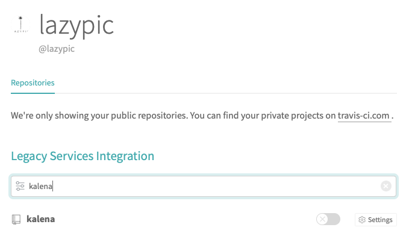
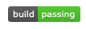
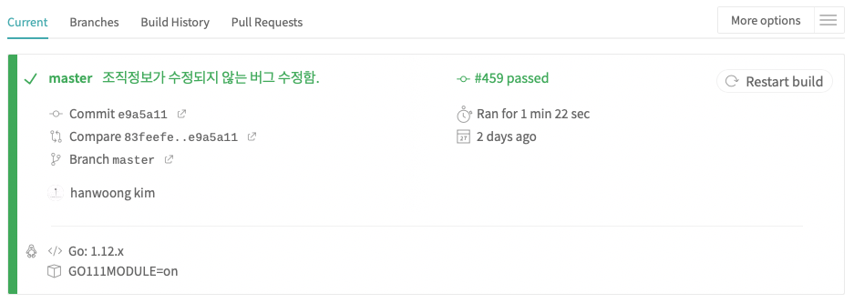
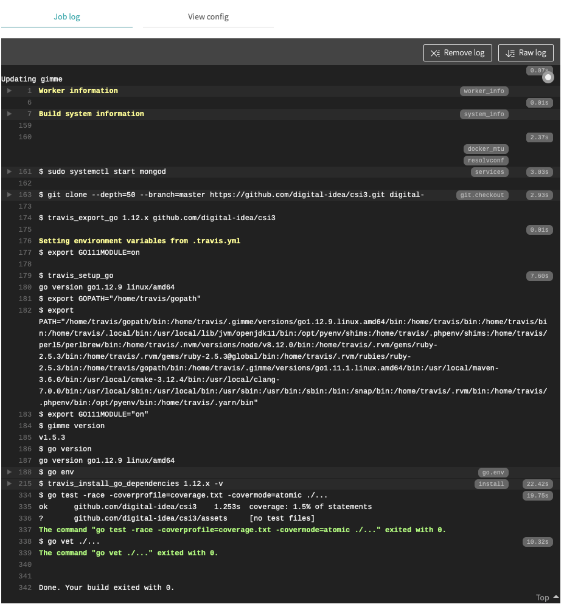

# CI

우리가 작성한 코드를 아무것도 설치되지 않는 가상머신에서
빌드, 테스트할 필요가 있습니다.
혹시 모를 의존성을 체크하고 팀 프로젝트가 항상 잘 빌드가 되는지 자동으로 검사하기  위해 CI를 사용합니다.

### Travis 가입
Github 아이디와 패스워드를 통해서 로그인 가능합니다.

https://travis-ci.org

> 오픈소스가 아닌 비공개 리포지터리라면 https://travis-ci.com 에서 유료로 사용해야 합니다.

### 테스트 리포지터리 등록
`+` 버튼을 누르고 테스트하고 싶은 리포지터리를 등록합니다.




해당 리포지터리를 활성화 해줍니다.

### .travis.yml 파일 생성
travisCI 가 작동되기 위해서는 자신의 리포지터리에 `.travis.yml` 파일이 필수로 생성되어야 합니다.

우리는 Go 언어를 사용하고 있습니다. 아래처럼 작성해 줍니다.

```yml
language: go

go:
 - 1.12.x

env:
 - GO111MODULE=on

services:
 - mongodb

script:
 - go test -race -coverprofile=coverage.txt -covermode=atomic ./...
 - go vet ./...
```

위 리스트는 언어, 언어버전, 환경변수, 필요한 서비스(저는 mongodb를 자주 사용합니다. 테스트시 mongoDB를 활성화 합니다.) 가상머신이 생성, 셋팅되고 script가 실행됩니다.
Go 에서는 `go test`, `go vet` 같은 테스트가 필요합니다. 기본적으로 넣어줍니다.

- 지원언어 리스트: https://docs.travis-ci.com/user/languages/
- Go 언어 셋팅: https://docs.travis-ci.com/user/languages/go/
- 서비스 리스트: https://docs.travis-ci.com/user/database-setup/

### Build passing 이미지정보를 Github에 추가하기
빌드 상태를 매번 TravisCI에 접속하여 확인하는 것은 귀찮은 일 입니다.
빌드 상태를 알 수 있는 이미지를 항상 리포지터리에 표기되도록 해두면 편리합니다.
문제가 발생했을 때만 TravisCI에 접속하여 상황을 점검하면 됩니다.



마크다운 형식으로는 아래처럼 작성합니다.

```md

```

### 상태확인
문제가 발생했을 때는 녹색이 아닌 주황색이 표기됩니다.
아래는 해당 이슈로 개발이 끝나고 CI에서 자동화 처리가 잘 된 사례를 보여주고 있습니다.




### 응 용
- https://openpipeline.io 사이트에 여러분의 리포지터리 TravisCI 상태이미지를 업데이트 해주세요.